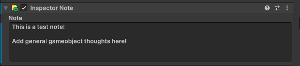

# Unity Inspector Notes

A small Unity package for attaching simple notes to GameObjects.

Requires Unity 2021.3 or newer.

## Installation

The easiest way to pull this package into another Unity project is through Unity Package Manager using the Git URL.

### Unity Package Manager

1. Open the Unity project that should use the package.
2. Go to `Window > Package Manager`.
3. Click the `+` button.
4. Choose `Add package from git URL...`.
5. Enter:

```text
https://github.com/Breakstep-Studios/unity-inspector-notes.git
```

### Manifest

You can also add it directly to the project's `Packages/manifest.json` file:

```json
{
    "dependencies": {
        "com.breakstepstudios.unity-inspector-notes": "https://github.com/Breakstep-Studios/unity-inspector-notes.git"
    }
}
```

### Version Pinning

For active development, using the Git URL directly is convenient because Unity pulls from the repository's default branch.

For production projects, prefer pinning to a release tag once one exists:

```text
https://github.com/Breakstep-Studios/unity-inspector-notes.git#v1.0.0
```

## Usage

Add the `Inspector Note` component to any GameObject, then write the note in the component's inspector.


